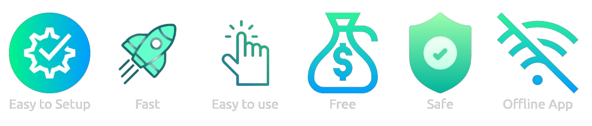

<h1>Instant-Bot</h1>

<h2>GUI Automation Application</h2>
A desktop application to create python Bots that can trigger different repetitive GUI events to finish repetitive tasks quickly, by taking control on keyboard & mouse.

 

<h2>Why to use Instant Bot</h2>

<h2>How to get this application in your PC?</h2>
<ol>
    <li> Install _chrome browser_ in your PC (Pre-Requisite)
    <li> Download <a href="https://github.com/deepakrathore2k1/Instant-Bot/raw/master/Instant%20Bot.zip">Instant Bot</a> Packaged zip file.  Link: <a>https://github.com/deepakrathore2k1/Instant-Bot/raw/master/Instant%20Bot.zip</a>
    <li> Unzip Instant Bot.zip
    <li> Run <b>Instant Bot/Instant Bot.exe</b>
     <b>Note: </b> Available For Windows only 
</ol> 

<h2>Tech Stack used in the Project</h2>
<ul>
    <li>Eel: It is a Python library for making offline HTML/JS GUI apps, with full access to Python capabilities and libraries. It hosts a local webserver, then lets you annotate functions in Python so that they can be called from Javascript, and vice versa.</li>
    <li>PyAutoGUI: It is a Python package that works across different OS to provides the ability to simulate mouse cursor moves and clicks as well as keyboard button presses actions via python scripts.</li>
    <li>HTML, CSS, and Javascript is used to create the application UI and provide the better User Experience.</li>
</li>
</ul> 
